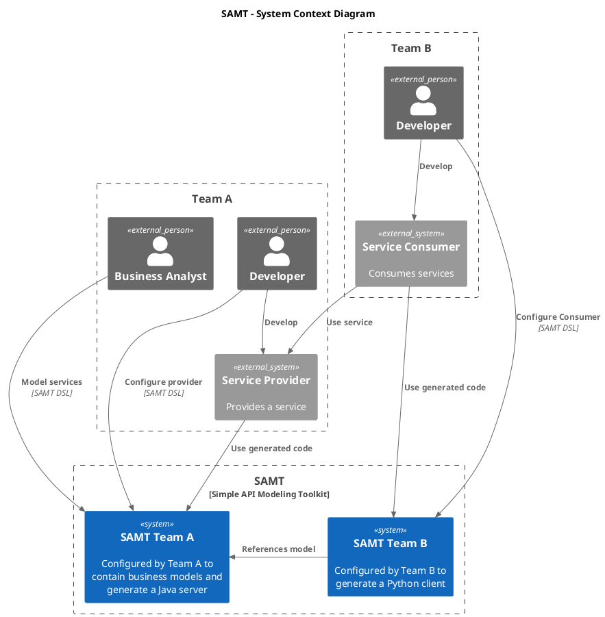
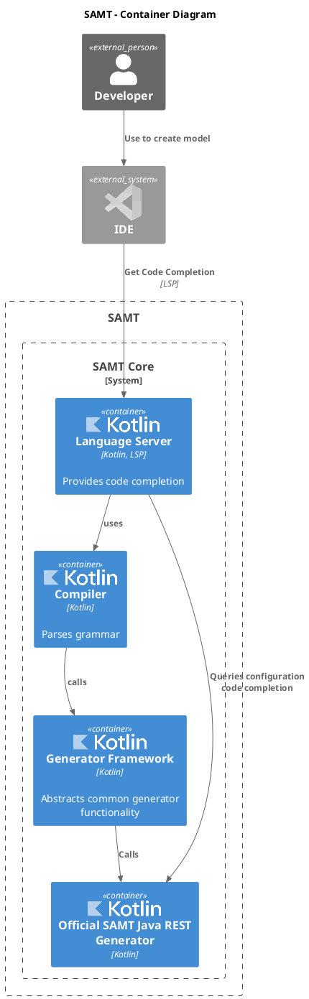
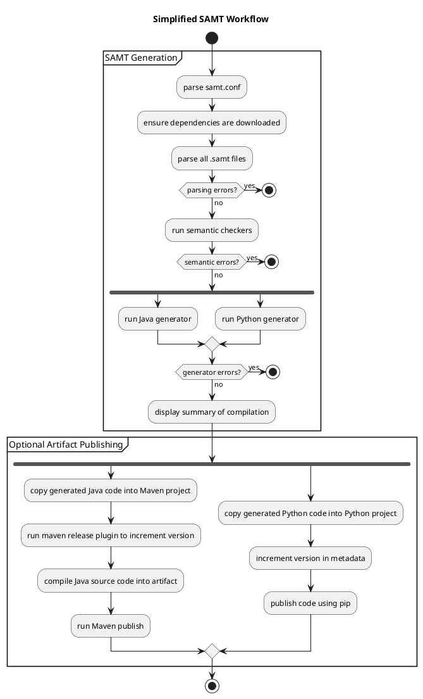
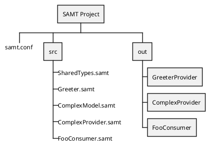

# Architecture

## System Context Diagram




## Container Diagram (Complete)


```plantuml
!include <C4/C4_Container>

!include <logos/kotlin>
!include <logos/java>
!include <logos/visual-studio-code>

title SAMT - Container Diagram

Person_Ext(developer, "Developer")

System_Ext(ide, "IDE", $sprite="visual-studio-code")

Boundary(samt, "SAMT") {
  System_Boundary(samtCore, "SAMT Core") {
    Container(languageServer, "Language Server", "Kotlin, LSP", "Provides code completion", $sprite="kotlin")
    Container(compiler, "Compiler", "Kotlin", "Parses grammar", $sprite="kotlin")
    Container(generatorFramework, "Generator Framework", "Kotlin", "Abstracts common generator functionality", $sprite="kotlin")
  }

  System_Boundary(samtGenerators, "SAMT Generators") {
    Container(samtJavaRest, "Official SAMT Java REST Generator", "Kotlin", $sprite="kotlin")
  }
}


System_Boundary(externalGenerators, "External Generators") {
  Container_Ext(samtJavaGrpc, "External SAMT Java gRPC Generator", "Java", $sprite="java")
}

Rel(ide, languageServer, "Get Code Completion", "LSP")
Rel(developer, ide, "Use to create model")

Rel(languageServer, compiler, "uses")
Rel(compiler, generatorFramework, "calls")


Rel(generatorFramework, samtJavaRest, "Calls")
Rel(generatorFramework, samtJavaGrpc, "Calls")

Rel(languageServer, samtJavaRest, "Queries configuration code completion")
Rel(languageServer, samtJavaGrpc, "Queries configuration code completion")

@enduml
```

## Container Diagram (Simplified)




## Workflow Diagram





