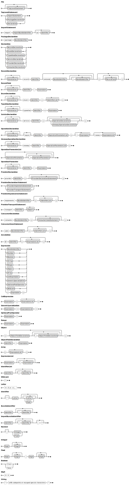

```ebnf
File = { ImportStatement }, PackageDeclaration, { Declaration };

ImportStatement = "import", ImportBundleIdentifier, ["as", Identifier];

PackageDeclaration = "package", BundleIdentifier;

Declaration = RecordDeclaration
                            | EnumDeclaration
                            | TypeAliasDeclaration
                            | ServiceDeclaration
                            | ProviderDeclaration
                            | ConsumerDeclaration;

RecordDeclaration = { Annotation }, "record", Identifier, ["extends", BundleIdentifier, {",", BundleIdentifier}], "{", { RecordField }, "}";

RecordField = { Annotation }, Identifier, ":", Expression;

EnumDeclaration = { Annotation }, "enum", Identifier, "{", [IdentifierList], "}";

TypeAliasDeclaration = { Annotation }, "alias", Identifier, ":", Expression;

ServiceDeclaration = { Annotation }, "service", Identifier, "{", { OperationDeclaration | OnewayOperationDeclaration }, "}";

OperationDeclaration = { Annotation }, [ "async" ], Identifier, "(", OperationParameterList, ")", [ ":", Expression ], ["raises", ExpressionList];

OnewayOperationDeclaration = { Annotation }, "oneway", Identifier, "(", OperationParameterList, ")";

OperationParameterList = [ OperationParameter, { ",", OperationParameter } ];

OperationParameter = { Annotation }, Identifier, ":", Expression;

ProviderDeclaration = "provide", Identifier, "{", {ProviderDeclarationStatement}, "}";

ProviderDeclarationStatement = ProviderImplementsStatement
                              | ProviderTransportStatement;

ProviderImplementsStatement = "implements", BundleIdentifier, ["{", [IdentifierList], "}"];

ProviderTransportStatement = "transport", Identifier, [Object];

ConsumerDeclaration = "consume", BundleIdentifier, "{", {ConsumerUsesStatement}, "}";

ConsumerUsesStatement = "uses", BundleIdentifier, ["{", [IdentifierList], "}"];

Annotation = "@", Identifier, [ "(", [ExpressionList], ")" ];

Expression = BundleIdentifier
            | Number
            | Boolean
            | String
            | Range
            | Object
            | Array
            | CallExpression
            | GenericSpecialization
            | OptionalPostOperator
            | Wildcard
            | ("(", Expression, ")");

CallExpression = Expression, "(", [ExpressionList], ")";

GenericSpecialization = Expression, "<", ExpressionList, ">";

OptionalPostOperator = Expression, "?";

Range = Expression, "..", Expression;

Object = "{", [ObjectFieldDeclaration, {",", ObjectFieldDeclaration}], "}";

ObjectFieldDeclaration = Identifier, ":", Expression;

Array = "[", [ ExpressionList ], "]";

ExpressionList = Expression, { ",", Expression };

IdentifierList = Identifier, { ",", Identifier };

Wildcard = "*";

Letter = ? A - Z | a - z | _ ?;
Identifier = ["^"], Letter, { Letter | Digit };
BundleIdentifier = Identifier, { ".", Identifier};
ImportBundleIdentifier = Identifier, { ".", Identifier}, [".", "*"];
Number = ["-"], (Integer | Float);
Integer = Digit, { Digit };
Float = (Digit, { Digit }), ".", (Digit, { Digit });
Boolean = "true" | "false";
Digit = ? 0 - 9 ?;
String = '"', ?utf8 codepoints or escaped special characters?, '"';
```


